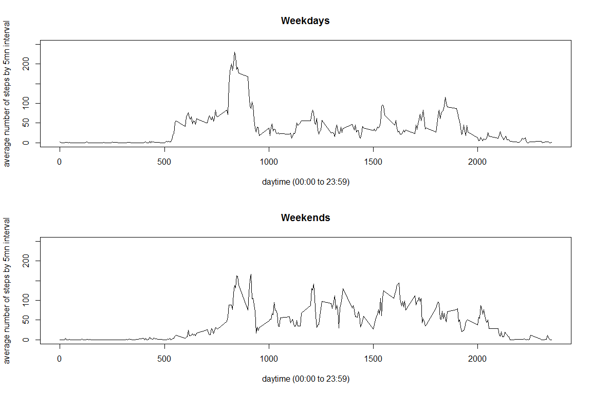

Reproducible Research: Peer Assessment 1
================

Loading and preprocessing the data
----------------------------------

First, we load the data and install a way to check first that it hasn't been loaded before, as this might impact the computer performance. We also unzip the file.

``` r
dataUrl <- "https://d396qusza40orc.cloudfront.net/repdata%2Fdata%2Factivity.zip"
dataDir <- "data"
zipFile <- file.path(dataDir, "zippedData.zip")
if(!dir.exists(dataDir)){
        dir.create(dataDir)
}
if(!file.exists(zipFile)){
        download.file(dataUrl, zipFile)
        unzip(zipFile, exdir= dataDir)
}                

activity <- read.csv(file.path("data", "activity.csv"))
```

Now that we have the date unzipped data on our computer, we check the name(s) of the unzipped files:

``` r
dir(path ="./data")
```

    ## [1] "activity.csv"   "zippedData.zip"

Our unique file is called "activity.csv". Let's have a first look inside:

``` r
activity <- read.csv(file.path("data", "activity.csv"))
str(activity)
```

    ## 'data.frame':    17568 obs. of  3 variables:
    ##  $ steps   : int  NA NA NA NA NA NA NA NA NA NA ...
    ##  $ date    : Factor w/ 61 levels "2012-10-01","2012-10-02",..: 1 1 1 1 1 1 1 1 1 1 ...
    ##  $ interval: int  0 5 10 15 20 25 30 35 40 45 ...

So we can see that in this database, days are called "date" (variable name) and are seen as factors, while the 5-mn time slot is treated as an integer reproducing the time of the day (3rd column).

#### Converting interval to date format in a new variable called daytime

We create an additional variable that will keep the interval column unchanged and transform it elsewhere in a time convenient format for further application.

First, we call for dplyr library.

``` r
if (!require(dplyr)){
        install.packages(dplyr)
}
```

    ## Loading required package: dplyr

    ## Warning: package 'dplyr' was built under R version 3.4.2

    ## 
    ## Attaching package: 'dplyr'

    ## The following objects are masked from 'package:stats':
    ## 
    ##     filter, lag

    ## The following objects are masked from 'package:base':
    ## 
    ##     intersect, setdiff, setequal, union

``` r
library(dplyr)
```

Now to the tidying process:

``` r
activity <- activity%>%
        mutate(daytime = as.character(interval))
for (i in 1:length(activity$daytime)){
        if (nchar(activity$daytime[i]) == 1){
                activity$daytime[i] <- paste("000", activity$daytime[i], sep = "")
        }
        if(nchar(activity$daytime[i]) == 2){
                activity$daytime[i] <- paste("00", activity$daytime[i], sep = "")
        }

        if(nchar(activity$daytime[i]) == 3){
                activity$daytime[i] <- paste("0", activity$daytime[i], sep = "") 
        }
}

activity$daytime <- strptime(activity$daytime, "%H%M")
activity$daytime <- as.POSIXlt(activity$daytime, "%H%M")

activity$daytime <- format(as.POSIXlt(activity$daytime, "%H%M"), format ="%H:%M")
```

What is mean total number of steps taken per day?
-------------------------------------------------

Now, let's manipulate the data a little by regrouping them by day and sum the steps accordingly. We get the sum of steps for each day in a new data frame called dailySteps and get an overview of the data, without paying attention to NA's except by removing them.

``` r
dailySteps <- activity %>%
        group_by(date)%>%
        summarize(sum(steps, na.rm = TRUE))
names(dailySteps) <- c("date", "daily.steps") 
DS_in_brief <- summary(dailySteps$daily.steps)
print(DS_in_brief)
```

    ##    Min. 1st Qu.  Median    Mean 3rd Qu.    Max. 
    ##       0    6778   10395    9354   12811   21194

We can see that there are missing days out of the 61 initial ones, obviously because of NA's. From this data summary, we will be able to extract mean and median for our plot.

Now to the plot:

``` r
### plot 1 : daily steps, without imputing NA's #####
hist(dailySteps$daily.steps, freq = TRUE, main = "Daily Steps", xlab = "Number of Daily Steps", ylab= "Frequency (in days)")
abline(v = DS_in_brief["Mean"], lwd = 5, l = 2, col = "blue")
abline(v = DS_in_brief["Median"], lwd=2, l = 2, col = "red")
legend("topright", l=2, lwd=c(3, 2), cex= .7, col = c("blue", "red"), legend = c("Mean", "Median"))
```


What is the average daily activity pattern?
-------------------------------------------

Creating an appropriate data summary for this question and printing out the summary:

``` r
stepsInDay <- activity %>%
        group_by(interval)%>%
        summarize(mean(steps, na.rm = TRUE))
names(stepsInDay) <- c("day.time", "steps.averaged")
print(summary(stepsInDay$steps.averaged))
```

    ##    Min. 1st Qu.  Median    Mean 3rd Qu.    Max. 
    ##   0.000   2.486  34.113  37.383  52.835 206.170

So there can be up to over 200 steps in a typical 5-min-interval. The overall 5-min-average is around 35 steps though. And some intervals we expect to be at night have 0 as mean.

Before plotting this, we convert day.time to a more readable time format as we want to include the time when maximum steps occur in our plot:

``` r
stepsInDay2 <- stepsInDay #saving a copy for later use

stepsInDay$day.time <- as.character(stepsInDay$day.time)
for (i in 1:length(stepsInDay$day.time)){
        if (nchar(stepsInDay$day.time[i]) == 1){
                stepsInDay$day.time[i] <- paste("000", stepsInDay$day.time[i], sep = "")
        }
        if(nchar(stepsInDay$day.time[i]) == 2){
                stepsInDay$day.time[i] <- paste("00", stepsInDay$day.time[i], sep = "")
        }

        if(nchar(stepsInDay$day.time[i]) == 3){
                stepsInDay$day.time[i] <- paste("0", stepsInDay$day.time[i], sep = "") 
        }
}

stepsInDay$day.time <- strptime(stepsInDay$day.time, "%H%M")
stepsInDay$day.time <- as.POSIXlt(stepsInDay$day.time, "%H%M")
stepsInDay$day.time <- format(stepsInDay$day.time, format ="%H:%M")
```

Plotting the results, including time of day with most steps (using the function which.max):

``` r
#### Plot 2: daily patterns ####
with(stepsInDay, plot(steps.averaged, type = "l", lwd = 1, xaxt = "n", main = "Daily pattern", xlab = "Daytime (0-24 o'clock)", ylab = "5 min interval number of steps (average)", ylim = c(0, 250)))

t <- 0:24
tm <- t*12

axis(1, at = tm, labels = t)
        
# maxsteps = stepsInDay$day.time[which.max(stepsInDay$steps.averaged)]

abline(v = which.max(stepsInDay$steps.averaged), col = "green", lwd = 4)

text(x= which.max(stepsInDay$steps.averaged) - 10, y = 200, labels = (stepsInDay$day.time[which.max(stepsInDay$steps.averaged)]))

legend("topright", lty = 1, lwd= 4, col = "green", legend = "start of the 5-min day interval when the average maximum number of steps occurs", cex = .7)
```


Imputing missing values
-----------------------

We could already see that there are many NA's in the 1st step column of the original dataset. Let's compute the number of NA's (in other words the number of values missing) and the percentage of data it represents in the dataset.

``` r
paste("number of values missing:", sum(is.na(activity)))
```

    ## [1] "number of values missing: 2304"

``` r
paste(round(sum(is.na(activity))/dim(activity)[1]*100), "% of the total", sep ="")
```

    ## [1] "13% of the total"

Now let's impute NA's by filling the gaps with averaged daytime values for each. We'll create a new dataframe for that purpose, and we'll also add a test column with logical values (is.na) to more closely monitor the replacement process and check on the final dataframe.

``` r
myNAs <- as.data.frame(is.na(activity))
colSums(myNAs)
```

    ##    steps     date interval  daytime 
    ##     2304        0        0        0

``` r
DF_imputed <- activity %>%
        mutate(missing.values= myNAs$steps)

DF_imputed <- merge(DF_imputed, stepsInDay2, by.x="interval", by.y = "day.time", all.x = TRUE)


for(i in 1:dim(DF_imputed)[1]){
        if (is.na(DF_imputed$steps[i])){
                DF_imputed$steps[i] <- DF_imputed$steps.averaged[i]
        }
}
```

Now let's summarize this all over again in order to compare with our previous results:

``` r
dailySteps2 <- DF_imputed %>%
        group_by(date)%>%
        summarize(sum(steps))
names(dailySteps2) <- c("date", "daily.steps") 
DS_in_brief2 <- summary(dailySteps2$daily.steps)
print(DS_in_brief2)
```

    ##    Min. 1st Qu.  Median    Mean 3rd Qu.    Max. 
    ##      41    9819   10766   10766   12811   21194

Now to the plot:

``` r
par(mfrow= c(2, 1))
hist(dailySteps$daily.steps, freq = TRUE, main = "daily steps: histogram", xlab = "Number of Daily Steps", ylab= "Frequency (in days)")
abline(v = DS_in_brief["Mean"], lwd = 5, l = 2, col = "blue")
abline(v = DS_in_brief["Median"], lwd=2, l = 2, col = "red")
legend("topright", l=2, lwd=c(3, 2), cex= .7, col = c("blue", "red"), legend = c("mean", "median"))

hist(dailySteps2$daily.steps, freq = TRUE, main = "daily steps: histogram (NAs imputed)", xlab = "Number of Daily Steps", ylab= "Frequency (in days)")
abline(v = DS_in_brief2["Mean"], lwd = 5, l = 2, col = "blue")
abline(v = DS_in_brief2["Median"], lwd=2, l = 2, col = "red")
legend("topright", l=2, lwd=c(3, 2), cex= .7, col = c("blue", "red"), legend = c("mean", "median"))
```


Are there differences in activity patterns between weekdays and weekends?
-------------------------------------------------------------------------

First, let's process the NA-imputed dataset in order to get the weekdays and thus discriminate between weekdays and weekends.

``` r
Sys.setlocale("LC_TIME", "English") 
```

    ## [1] "English_United States.1252"

``` r
DF_imputed$date <- as.Date(DF_imputed$date)
DF_imputed <- DF_imputed %>%
        mutate(week.day = format(DF_imputed$date, "%a"))
for (i in 1:dim(DF_imputed)[1]){
        if ((DF_imputed$week.day[i] == "Sat") | (DF_imputed$week.day[i] == "Sun")){
                DF_imputed$week.day[i] = "WE"
        }else{
                DF_imputed$week.day[i] = "WD"
        }
}

DF_imputed$week.day <- as.factor(DF_imputed$week.day)

table(DF_imputed$week.day)
```

    ## 
    ##    WD    WE 
    ## 12960  4608

Now let's map the data for weekdays Vs. weekends.

``` r
### weekdays data summary

wkdays_summary <- DF_imputed%>%
        filter(week.day=="WD")%>%
        group_by(interval)%>%
        summarize(mean(steps))

names(wkdays_summary) <- c("interval", "steps.averaged")

print(str(wkdays_summary))
```

    ## Classes 'tbl_df', 'tbl' and 'data.frame':    288 obs. of  2 variables:
    ##  $ interval      : int  0 5 10 15 20 25 30 35 40 45 ...
    ##  $ steps.averaged: num  2.251 0.445 0.173 0.198 0.099 ...
    ## NULL

``` r
### weekend data summary

wkend_summary <- DF_imputed%>%
        filter(week.day=="WE")%>%
        group_by(interval)%>%
        summarize(mean(steps))

names(wkend_summary) <- c("interval", "steps.averaged")

print(summary(wkend_summary$steps.averaged))
```

    ##    Min. 1st Qu.  Median    Mean 3rd Qu.    Max. 
    ##   0.000   1.241  32.340  42.366  74.654 166.639

Now to the final plot:

``` r
par(mfrow=c(2,1))

with(wkdays_summary, plot(interval, steps.averaged, type = "l", ylim = c(0, 250), xlab = "daytime (00:00 to 23:59)", ylab ="average number of steps by 5mn interval", main = "Weekdays"))
with(wkend_summary, plot(interval, steps.averaged, type = "l", ylim = c(0, 250), xlab = "daytime (00:00 to 23:59)", ylab ="average number of steps by 5mn interval", main = "Weekends"))
```


